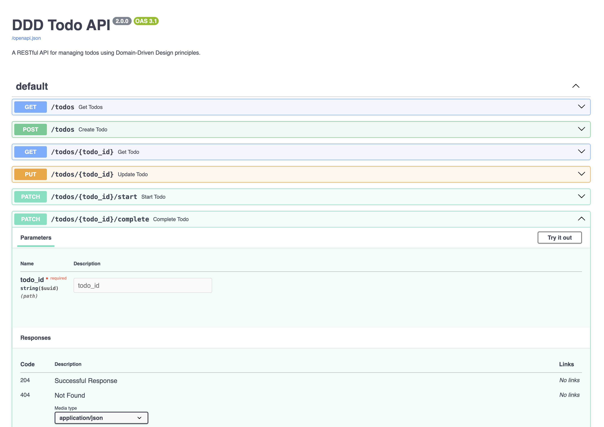

# Python DDD Example and Techniques

[](https://github.com/iktakahiro/dddpy/actions/workflows/test.yml)

*NOTE: This repository is an example to explain 'how to implement DDD architecture on a Python web application'. If you will to use this as a reference, add your implementation of authentication and security before deploying to the real world!!*

## Tech Stack

* [FastAPI](https://fastapi.tiangolo.com/)
* [SQLAlchemy](https://www.sqlalchemy.org/)
  * [SQLite](https://www.sqlite.org/index.html)
* [Poetry](https://python-poetry.org/)
* [Docker](https://www.docker.com/)

## Code Architecture

Directory structure (based on [Onion Architecture](https://jeffreypalermo.com/2008/07/the-onion-architecture-part-1/)):

```tree
├── main.py
├── dddpy
│   ├── domain
│   │   └── book
│   │       ├── book.py  # Entity
│   │       ├── book_exception.py  # Exception definitions
│   │       ├── book_repository.py  # Repository interface
│   │       └── isbn.py  # Value Object
│   ├── infrastructure
│   │   └── sqlite
│   │       ├── book
│   │       │   ├── book_dto.py  # DTO using SQLAlchemy
│   │       │   ├── book_query_service.py  # Query service implementation
│   │       │   └── book_repository.py  # Repository implementation
│   │       └── database.py
│   ├── presentation
│   │   └── schema
│   │       └── book
│   │           └── book_error_message.py
│   └── usecase
│       └── book
│           ├── book_command_model.py  # Write models including schemas of the RESTFul API
│           ├── book_command_usecase.py
│           ├── book_query_model.py  # Read models including schemas
│           ├── book_query_service.py  # Query service interface
│           └── book_query_usecase.py
└── tests
```

### Entity

To represent an Entity in Python, use `__eq__()` method to ensure the object's itendity.

* [book.py](./dddpy/domain/book/book.py)

```python
class Book:
    def __init__(self, id: str, title: str):
        self.id: str = id
        self.title: str = title

    def __eq__(self, o: object) -> bool:
        if isinstance(o, Book):
            return self.id == o.id

        return False
```

### Value Object

To represent a Value Object, use `@dataclass` decorator with `eq=True` and `frozen=True`.

The following code implements a book's ISBN code as a Value Object.

* [isbn.py](./dddpy/domain/book/isbn.py)

```python
@dataclass(init=False, eq=True, frozen=True)
class Isbn:
    value: str

    def __init__(self, value: str):
        if !validate_isbn(value):
            raise ValueError("value should be valid ISBN format.")

        object.__setattr__(self, "value", value)
```

### DTO (Data Transfer Object)

DTO (Data Transfer Object) is a good practice to isolate domain objects from the infrastructure layer.

On a minimum MVC architecture, models often inherit a base class provided by an O/R Mapper. But in that case, the domain layer would be dependent on the outer layer.

To solve this problem, we can set two rules:

1. Domain layer classes (such as an Entity or a Value Object) **DO NOT** extend SQLAlchemy Base class.
2. Data transfer Objects extend the O/R mapper class.
   * [book_dto.py](./dddpy/infrastructure/sqlite/book/book_dto.py)

### CQRS

CQRS (Command and Query Responsibility Segregation) pattern is useful 

* Read model and Write model
  1. Define read models and write models in the **usecase layer**
     * [book_query_model.py](./dddpy/usecase/book/book_query_model.py)
     * [book_command_model.py](./dddpy/usecase/book/book_command_model.py)
* Query
  1. Define query service interfaces in the **usecase layer**
     * [book_query_service.py (interface)](./dddpy/usecase/book/book_query_service.py)
  2. Implement query service implimentations in the **infrastructure layer**
     * [book_query_service.py](./dddpy/infrastructure/sqlite/book/book_query_service.py)
* Command
  1. Define repository interfaces in the **domain layer**
     * [book_repository.py (interface)](./dddpy/domain/book/book_repository.py)
  2. Implement repository implimentations in the **infrastructure layer**
     * [book_repository.py](./dddpy/infrastructure/sqlite/book/book_repository.py)
* Usecase
  1. Usecases depend on repository interfaces or query service interfaces.
     * [book_query_usecase.py](./dddpy/usecase/book/book_query_usecase.py)
     * [book_command_usecase.py](./dddpy/usecase/book/book_command_usecase.py)
  2. Usecases return an instance of read|write model to a main routine.

### UoW (Unit of Work)

Even if we succeed in isolating the domain layer, some issues remain. One of them is *how to manage transactions*.

UoW (Unit of Work) Pattern can be the solution.

First, difine an interface base on UoW pattern in the usecase layer. `begin()`, `commit()` and `rollback()` methods are related a transaction management.

* [book_command_usecase.py](./dddpy/usecase/book/book_command_usecase.py)

```python
class BookCommandUseCaseUnitOfWork(ABC):
    book_repository: BookRepository

    @abstractmethod
    def begin(self):
        raise NotImplementedError

    @abstractmethod
    def commit(self):
        raise NotImplementedError

    @abstractmethod
    def rollback(self):
        raise NotImplementedError
```

Second, implement a class of the infrastructure layer using the above interface.

* [book_repository.py](./dddpy/infrastructure/sqlite/book/book_repository.py)

```python
class BookCommandUseCaseUnitOfWorkImpl(BookCommandUseCaseUnitOfWork):
    def __init__(
        self,
        session: Session,
        book_repository: BookRepository,
    ):
        self.session: Session = session
        self.book_repository: BookRepository = book_repository

    def begin(self):
        self.session.begin()

    def commit(self):
        self.session.commit()

    def rollback(self):
        self.session.rollback()
```

`session` property is a session of SQLAlchemy,

## How to work

1. Clone and open this repository using VSCode
2. Run Remote-Container
3. Run `make dev` on the Docker container terminal
4. Access the API document http://127.0.0.1:8000/docs



### Sample requests for the RESTFul API

* Create a new book:

```bash
curl --location --request POST 'localhost:8000/books' \
--header 'Content-Type: application/json' \
--data-raw '{
    "isbn": "978-0321125217",
    "title": "Domain-Driven Design: Tackling Complexity in the Heart of Software",
    "page": 560
}'
```

* Response of the POST request:

```json
{
    "id": "HH9uqNdYbjScdiLgaTApcS",
    "isbn": "978-0321125217",
    "title": "Domain-Driven Design: Tackling Complexity in the Heart of Software",
    "page": 560,
    "read_page": 0,
    "created_at": 1614007224642,
    "updated_at": 1614007224642
}
```

* Get books:

```bash
curl --location --request GET 'localhost:8000/books'
```

* Response of the GET request:

```json
[
    {
        "id": "e74R3Prx8SfcY8KJFkGVf3",
        "isbn": "978-0321125217",
        "title": "Domain-Driven Design: Tackling Complexity in the Heart of Software",
        "page": 560,
        "read_page": 0,
        "created_at": 1614006055213,
        "updated_at": 1614006055213
    }
]
```
